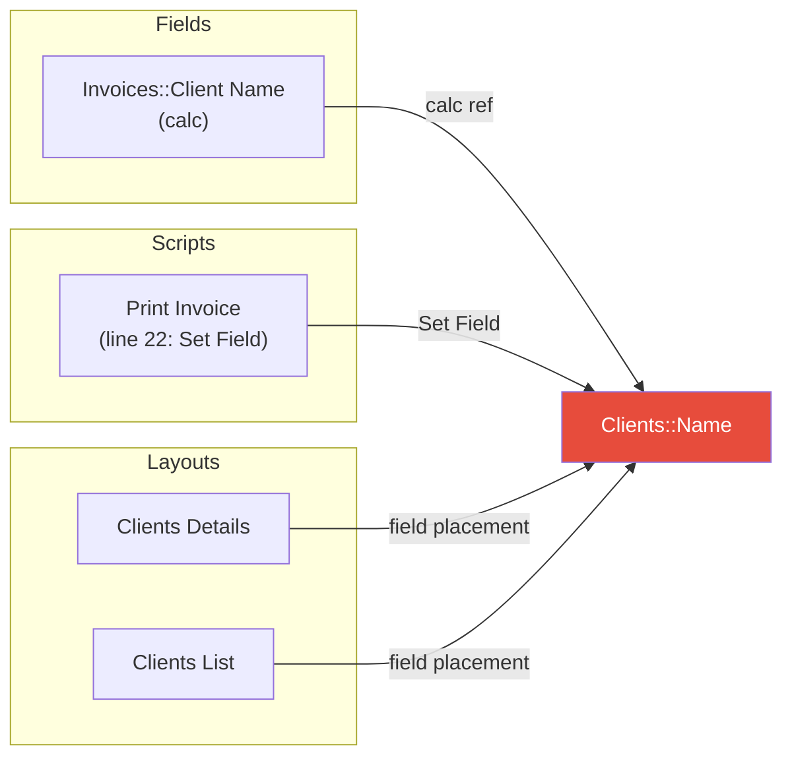
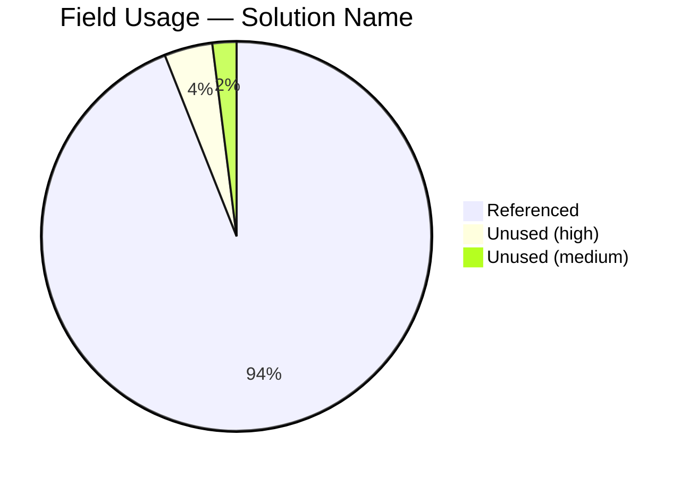

# Trace — Cross-Reference Tracer

This skill traces references to FileMaker objects (fields, scripts, custom functions, layouts, value lists) across an entire solution. It combines a **deterministic Python engine** (`agent/scripts/trace.py`) for fast, exhaustive scanning with **agentic correlation** for edge cases that require judgment.

## Architecture

### Layer 1: Deterministic engine (`trace.py`)

Scans all solution data sources and builds `agent/context/{solution}/xref.index` — a compact cross-reference index. Supports three commands:

```bash
python3 agent/scripts/trace.py build  -s "Solution Name"     # build xref.index
python3 agent/scripts/trace.py query  -s "Solution Name" -t TYPE -n "Name"  # query refs
python3 agent/scripts/trace.py dead   -s "Solution Name" -t TYPE  # find unused objects
```

Query types: `field`, `script`, `layout`, `value_list`, `custom_func`, `table_occurrence`
Dead types: `fields`, `scripts`, `custom_functions`, `layouts`, `value_lists`

### Layer 2: Agentic correlation (this skill)

Adds judgment for things static analysis cannot handle: ExecuteSQL strings, dynamic references, ambiguity resolution, severity classification, and false positive filtering.

## Data sources scanned by trace.py

| Source | What it finds |
|--------|---------------|
| `fields.index` — auto-enter and calc columns | Field-to-field references, custom function calls in calcs |
| `scripts_sanitized/*.txt` | Field refs (Set Field, Set Variable, If, etc.), layout refs (Go to Layout), script refs (Perform Script), CF calls |
| `custom_functions_sanitized/*.txt` | TO::Field refs, CF-to-CF calls |
| `context/{solution}/layouts/*.json` | Field placements and button scripts on layouts |
| `relationships.index` | Join field references |
| `value_lists/*.xml` | Field-based value list sources |

All field references are normalized to **canonical form** (`BaseTable::FieldName`) using `table_occurrences.index` for TO resolution. The original TO is preserved in the reference context.

---

## Workflow

### Step 1 — Determine solution and ensure xref.index exists

List subdirectories under `agent/context/`:

```bash
ls agent/context/
```

- If one subfolder exists, use it automatically.
- If multiple exist, use `AskUserQuestion` to ask which solution.
- If none exist, instruct the developer to run `fmcontext.sh`.

Check if `agent/context/{solution}/xref.index` exists. If missing or stale, build it:

```bash
python3 agent/scripts/trace.py build -s "{solution}"
```

**Layout summary dependency**: If `agent/context/{solution}/layouts/` is empty or missing, warn and suggest:

```bash
python3 agent/scripts/layout_to_summary.py --solution "{solution}"
```

Then rebuild xref.index.

### Step 2 — Infer mode from the developer's request

| Request pattern | Mode | Action |
|----------------|------|--------|
| "Where is X used?" / "Find references to X" / "Trace X" | **Usage** | Run `query` for the named object |
| "What breaks if I rename X?" / "Impact of changing X" | **Impact** | Run `query` for the object + agentic severity analysis |
| "Show unused fields" / "Dead code" / "Unused scripts" | **Dead** | Run `dead` for the specified type |
| "What does X reference?" / "Dependencies of X" | **Outbound** | Run `query --direction outbound` |

### Step 3 — Run the deterministic query

**Usage mode**:

```bash
python3 agent/scripts/trace.py query -s "{solution}" -t {type} -n "{name}"
```

The query accepts both canonical (`Clients::Name`) and TO-qualified (`Clients Primary::Name`) input — the engine resolves TOs automatically.

**Dead mode**:

```bash
python3 agent/scripts/trace.py dead -s "{solution}" -t {type}
```

Add `--verbose` to include low-confidence results (system fields, globals, summaries).

**Impact mode**: Run multiple queries as needed — e.g., for a table rename, query all fields in that table plus the table name itself as a table occurrence.

### Step 4 — Agentic correlation

After getting the deterministic results, apply judgment for edge cases the engine cannot handle:

#### a. ExecuteSQL string analysis

Grep `scripts_sanitized/` for `ExecuteSQL` calls:

```bash
grep -r "ExecuteSQL" "agent/xml_parsed/scripts_sanitized/{solution}/" --include="*.txt" -l
```

For each hit, read the script and analyze the SQL string:
- SQL uses **raw table names** (not TOs) and may differ from FM field names
- SQL strings may be built via concatenation or variables
- Map SQL table/column names to base tables/fields from `fields.index`
- Flag as "dynamic reference — may be affected" with explanation

#### b. Dynamic references

Flag any script step using:
- **GetField()** / **GetFieldName()** — field names as strings or variables
- **Evaluate()** — arbitrary calculation evaluation at runtime
- **Perform Script by Name** — script name from a variable

Note the variable source so the developer can trace manually. These cannot be resolved statically.

#### c. Ambiguity resolution

When the same field name exists in multiple tables (e.g., `Status` in `Clients`, `Invoices`, and `Products`), unqualified references in calcs are ambiguous. Use layout context and TO context to disambiguate where possible.

#### d. Impact severity classification (impact mode only)

| Severity | Meaning | Examples |
|----------|---------|----------|
| **BREAK** | Direct reference that will error | Set Field, Set Variable, If condition referencing the renamed object |
| **WARN** | Indirect reference that may fail | ExecuteSQL string literal, GetField with concatenated name |
| **INFO** | FM auto-updates on rename | Layout field placements, relationship graph join fields |

#### e. False positive filtering (dead mode)

Review dead object results and filter:
- Fields whose only auto-enter references `Self` (active even with no external refs)
- Scripts likely triggered by buttons — check layout summaries for button scripts
- Custom functions used only by other custom functions — trace the chain to see if it leads to active code
- Fields that serve as UI display only (on a layout, not in scripts) — flag as medium confidence, not truly dead

### Step 5 — Present the report

Format the combined results as a structured report appropriate to the mode:

**Usage mode**: Group by source type (field calcs, scripts, layouts, relationships, etc.) with counts.

**Impact mode**: Group by severity (BREAK, WARN, INFO) with specific locations and explanations.

**Dead mode**: Group by confidence (HIGH, MEDIUM, LOW) with counts and summary.

### Step 5b — Webviewer visualization (conditional)

Check if the webviewer is running:

```bash
curl -s http://localhost:8765/webviewer/status
```

If `"running": true`, prompt the developer:

> The webviewer is running. Would you like a visual diagram of these references?

If yes, generate a Mermaid diagram appropriate to the mode and push it:

#### Usage/Impact mode — Flowchart

Generate a `flowchart LR` centered on the target object, with subgraphs grouping referencing objects by type. For impact mode, color nodes by severity (red = BREAK, yellow = WARN, green = INFO).



#### Dead mode — Pie chart



#### Push to webviewer

```bash
curl -s -X POST http://localhost:8765/webviewer/push \
  -H "Content-Type: application/json" \
  -d '{"type": "diagram", "content": "<mermaid source>", "repo_path": "<project root>"}'
```

---

## xref.index format

Pipe-delimited, one line per reference:

```
# SourceType|SourceName|SourceLocation|RefType|RefName|RefContext
```

| Column | Description |
|--------|-------------|
| SourceType | `field_calc`, `field_auto`, `script`, `layout`, `custom_func`, `relationship`, `value_list` |
| SourceName | Canonical ID: `Invoices::Client Name`, `Print Invoice (ID 158)` |
| SourceLocation | Where: `calc:Clients Primary::Name`, `line 14: Set Field`, `field placement` |
| RefType | `field`, `script`, `layout`, `value_list`, `custom_func`, `table_occurrence` |
| RefName | Canonical (base table for fields): `Clients::Name` |
| RefContext | Detail: `via TO "Clients Primary"`, `same table`, `left side`, empty |

---

## Examples

### Example 1 — Usage report

Developer: "Where is `Clients::Name` used?"

1. Run `trace.py query -t field -n "Clients::Name"` → 9 references found
2. Check for ExecuteSQL calls → none reference the Clients table
3. Present report: 2 field calcs, 7 layout placements, 0 scripts

### Example 2 — Dead object scan

Developer: "Show me all unused fields"

1. Run `trace.py dead -t fields` → 3 high confidence, 0 medium
2. Verify: `Invoices::FoundCount` and `Line Items::FoundCount` are unstored calcs for `Get(FoundCount)` — used only at runtime on layouts with the field present
3. Check layouts for FoundCount fields → if present, downgrade to medium
4. Present report with confidence levels

### Example 3 — Impact analysis

Developer: "What breaks if I rename the Clients table to Companies?"

1. Query all `Clients::*` fields → list every reference
2. Query `Clients` as a table occurrence → relationships, Go to Related Record
3. Grep for `ExecuteSQL` referencing `Clients` (SQL table name)
4. Classify: Set Field/Set Variable refs = BREAK, layout placements = INFO, ExecuteSQL strings = WARN
5. Present severity-grouped report
6. If webviewer running, push flowchart diagram with severity coloring
